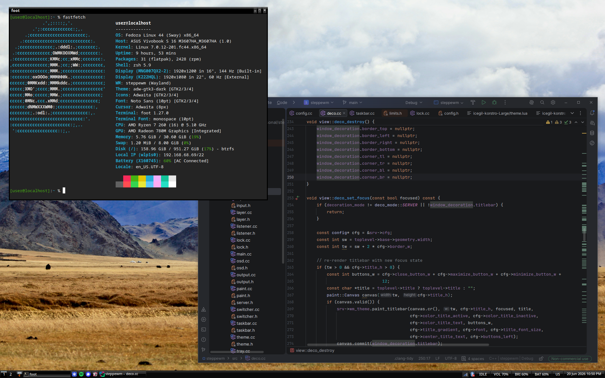

# steppewm

A minimal stacking Wayland compositor using wlroots

## Features

- Stacking window management
- Workspaces
- Taskbar
- Alt-Tab window switcher
- Window snapping
- OSD for volume, brightness and keyboard layout change
- Layer shell support
- Session lock
- Multi-monitor support
- XWayland via xwayland-satellite (optional)
- Lua configuration

## Dependencies

Required:

- wlroots 0.19
- wayland
- xkbcommon
- libinput
- lua 5.4
- pixman
- cairo

Optional:

- libpulse: volume things (taskbar and OSD)
- sdbus-c++: system tray (DBus)
- librsvg: svg icon rendering

## Building

```
meson setup build
meson compile -C build
meson install -C build
```

## Configuration

steppewm is configured through config.lua, which is looked for at
`$XDG_CONFIG_HOME/steppewm/config.lua` (`~/.config/steppewm/config.lua`).
A custom path can be passed with `steppewm -c /path/to/config.lua`

See the example config.lua for config options.

The config I use personally is here: https://github.com/uncognic/dotfiles/blob/main/.config/steppewm/config.lua
